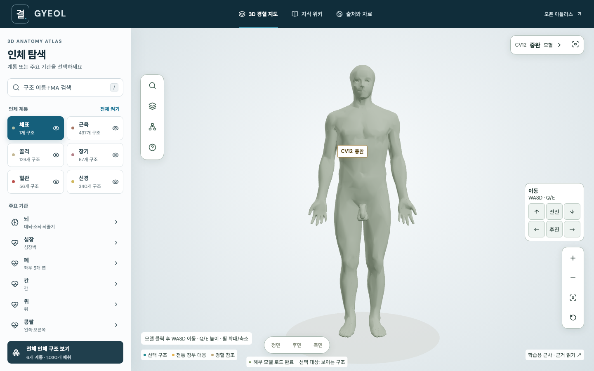

# 결 GYEOL

**오픈 3D 해부 모델과 경혈을 연결하는 한국어 학습 웹사이트 + 출처 기반 LLM 위키.**

BodyParts3D의 실제 피부·뼈·근육·장기·혈관·신경 모델을 회전하고, 경혈을 선택해 문헌 위치와 해부학적 기준점을 함께 읽습니다. 정규 14경맥 361개와 경외기혈 48개, 총 409개 경혈 및 위키 문서 419편을 수록합니다. 부위별 모델 필터, 전통적 활용과 음양오행·오수혈 분류를 제공합니다.



## 실행

Node.js 24 이상이 필요합니다. 모델 파일은 저장소에 포함되어 있어 처음 실행할 때 외부 모델 서버에 의존하지 않습니다.

```sh
npm ci
npm run dev
```

- 웹: http://localhost:5174
- 검색 API: http://127.0.0.1:3001/api/health
- Vite가 API를 프록시합니다. 개발 포트 5174는 다른 워크스페이스의 5173 서버와 충돌하지 않도록 선택했습니다.

배포용 실행:

```sh
npm run build
npm start
```

http://127.0.0.1:3001 에서 웹과 API를 함께 제공합니다. 다른 호스트에서 접속해야 하면 `.env`에서 `HOST=0.0.0.0`으로 설정합니다. 공개 서비스 운영에는 호스팅 환경의 HTTPS, 접근 제어 및 요청 제한을 함께 적용하세요. 2026-09-08에 Cloudflare 임시 HTTPS 터널을 연결했습니다. 현재 주소와 운영 상태는 [Cloudflare 접속 문서](docs/CLOUDFLARE.md)를 참조하세요.

## 구현된 기능

- BodyParts3D v3.0 + 공식 v4.3 보완 자료의 검색 가능 GLB 6개: 피부1, 골격·치아·연골278(손·발 마디뼈56 포함), 근육·힘줄·근막437, 장기·부속67, 혈관56, 신경계·관련 공간340 (총1,179 메쉬)
- Z-Anatomy 계보의 전신 보완 레이어: 좌우 전신 신경525개 구성요소, 심혈관640개 구성요소. 정확한 출처·해시·CC BY-SA 4.0 조건은 `data/catalog/full-system-supplement.json`에 기록
- 인체 구조도 중심의 전체 화면과 떠 있는 도구 패널, 모바일 축약 패널, 호버·키보드·터치 조작
- 101단계 연속 박리와 계통 빠른 보기, 시점·표식 유지, 개별 불투명도, 회전·확대·이동, 정면·후면·측면, 경혈 확대
- 한국어·영어·FMA 구조 검색, 단일 구조 및 장부 묶음 확대·단독 보기, 명시적 내부 선택
- 위키 왕복·새로고침 시 보기 상태 복원(같은 탭 세션), 손상 저장값 복구
- 경혈 코드·한글·한자·병음·해부 구조 검색, 신체 부위·경맥 필터
- 좌우 표식, 관련 해부 메쉬 강조, 북마크 로컬 저장, 경혈별 공유 링크
- 경혈 409편 및 분류·마사지·단계 탐색·개념·근거·좌표·라이선스·라이브러리 비교·음양오행 10편의 위키
- 문서 링크·역링크, 원문 출처·쪽수, Markdown·JSON·`llms.txt` 내보내기
- 출처 기반 질문 검색, 선택적 Ollama 요약, 출처 ID 검사, 근거 없음·연결 실패 처리
- 모바일 레이아웃, 모델 로딩·실패 및 WebGL 미지원 시 문서 탐색 유지

## 기술과 조사 문서

- [라이브러리 비교 분석](wiki/topics/library-comparison.md): Three.js/R3F, Babylon.js, vtk.js, model-viewer 및 검색·LLM 구성 선택
- [LLM 위키 설계와 편집 흐름](docs/LLM_WIKI.md)
- [좌표 방법론](wiki/topics/coordinate-method.md)
- [근거와 안전](wiki/topics/evidence.md)
- [자료 조사 기록](docs/RESEARCH.md)
- [완료 검증 기록](docs/VERIFICATION.md)
- [구조 확장·이동·가독성 검증](docs/anatomy-expansion/VERIFICATION.md)
- [지속 개선 기준](docs/QUALITY_STANDARD.md) 및 [작업 규칙](AGENTS.md)
- [상용 서비스 공개 화면 비교](docs/ui-renewal/COMMERCIAL_COMPARISON.md)
- [모델 원본·파일별 해시·변환 결과](public/models/manifest.json)
- [라이선스 구분과 귀속](THIRD_PARTY_NOTICES.md)

## 로컬 LLM 연결 (선택)

기본 동작은 위키 검색과 **저장된 문서의 발췌**입니다. 화면에 생성형 답변이 아님을 표시합니다. 실제 생성 답변은 Ollama가 설치·실행되고 모델이 준비된 경우에만 사용합니다.

```sh
ollama pull qwen3:0.6b
cp .env.example .env
```

`.env`에 다음을 설정하고 앱 서버를 재시작합니다.

```dotenv
OLLAMA_MODEL=qwen3:0.6b
OLLAMA_URL=http://127.0.0.1:11434
```

모델 이름은 예시이며 한국어 품질은 선택 모델과 하드웨어에 따라 달라집니다. Chat API 및 JSON schema 출력을 지원하는 로컬 모델을 사용할 수 있습니다. 실제 로컬 LLM은 이 작업 환경에서 설치하거나 실생성 검증하지 않았습니다. 공급자 계약·실패·허위 출처 처리는 모의 API로 테스트했습니다.

질문은 선택된 위키 문서와 함께 **서버에 설정된 Ollama 주소**로 전송합니다. 앱 자체는 질문이나 답변을 파일에 저장하지 않습니다. LLM 응답의 출처 ID 유효성은 검사하지만 내용의 의학적 사실성까지 자동 보증하지는 않습니다. 모델 연결 실패·25초 제한·잘못된 JSON·허위 출처가 나오면 검색 결과로 돌아갑니다.

## 데이터 편집·재생성

`data/points.json`, `data/meridians.json`, `data/sources.json`이 구조화 데이터의 원본입니다. 주제 위키는 `wiki/topics/*.md`를 직접 편집합니다. 경혈 문서와 배포 JSON은 다음 명령으로 생성합니다.

```sh
npm run wiki:build
```

`wiki/points/*.md`, `data/wiki.json`, `public/wiki/`, `public/llms.txt`는 생성 결과입니다. 직접 편집하면 다음 빌드에서 덮어씁니다. `scripts/create-content.py`는 초기 데이터 작성 기록으로, 다시 실행하면 수동 데이터 수정이 초기화되므로 일상 편집에 사용하지 않습니다.

모델 재현:

```sh
npm run models:build
```

고정된 원본 커밋의 781개 STL과 공식 4.3 메타데이터로 확인한 249개 OBJ를 `.cache/models/`에 내려받고, 정점 병합·단순화·축 변환 후 GLB와 매니페스트를 만듭니다. 최초 실행은 원본 다운로드에 약 200MB 이상의 저장 공간과 네트워크가 필요합니다. 재실행은 캐시를 사용합니다. `data/anchors.json`과 `public/models/acupoint-anchors.json`에 양측·정중선 65개 표면 대응 결과를 기록하며, 투영에 실패하면 빌드를 중단합니다. 주 좌표계는 X=모델 왼쪽, Y=위쪽, Z=앞쪽이며 단위는 m입니다.

## 검증

```sh
npm test
npm run build
npx playwright install chromium
npm run test:e2e
npm run test:production
```

Node 테스트: 참조 무결성, 메쉬·파일 유효성, 라이선스·해시 메타데이터, 위키 링크, 검색·API·LLM 계약과 실패 처리.

브라우저 테스트: 실제 GLB 로딩, 검색·선택·북마크·레이어·위키 질문 흐름, 모바일 가로 넘침, 잘못된 문서, 모델 실패 대체 화면. 새 캡처와 측정치는 `docs/ui-renewal/`에 저장합니다. `npm run test:visual`은 개발 서버를 이용하며, `SMOKE_ORIGIN`을 지정하면 배포 화면을 검사합니다.

## 정보의 범위

문헌 위치는 WHO 표준 항목의 짧은 학습 요약입니다. 3D 좌표는 이 프로젝트가 만든 **전문가 미검수 학습용 근사**입니다. BodyParts3D는 단일 남성 모델이며 개인차·자세·해부학적 오류 가능성이 있습니다. 특정 경혈의 치료 효과, 자침 방법, 깊이·각도 또는 진단을 제공하지 않습니다.

코드 MIT · 모델과 모델 파생 좌표 CC BY-SA 2.1 JP · 독자 위키 서술 CC BY 4.0. 세부 사항은 [THIRD_PARTY_NOTICES.md](THIRD_PARTY_NOTICES.md).

## 단계별 해부와 경혈 분류

0~100 연속 박리 슬라이더는 체표를 걷고 437개 근육 메쉬를 표면 근접도 순으로 개별 페이드해 같은 근육계 안의 표층·중간·심부 관계를 드러냅니다. 슬라이더 영역에서는 휠만으로, 3D 모델 위에서는 `Alt/Option + 휠` 또는 `Alt/Option + ↑/↓`로 깊이를 조절합니다. 일반 휠의 카메라 확대·축소는 그대로 유지됩니다. 깊어질수록 골격·장기·혈관·신경을 겹쳐 표시하며 계통 버튼은 단독 관찰을 위한 빠른 보기로 남깁니다. 이 순서는 메쉬 공간 관계에서 계산한 학습용 시각화이지 전문가가 분류한 해부학적 층판이나 수술 절개 경로가 아닙니다. 어두운 관찰 배경에 피부색, 근육 적색, 골격 상아색, 동맥 적색·정맥 청색, 신경 황색의 의학 아틀라스 관례 팔레트를 사용합니다.

원혈 12개·모혈 12개 전체와 수록점 중 오수혈 12개·낙혈 2개를 필터링합니다. 분류·전통 장부 대응은 `data/point-concepts.json`에 분리되어 있고, 장부 비교는 실제 메쉬를 강조합니다. 심포·삼초를 특정 단일 장기로 치환하지 않습니다. 마사지 참고 문서는 위치 비교와 근거를 제공하며 장기를 직접 누르는 깊이·힘이나 치료 효과를 안내하지 않습니다.

한국어 구조 이름은 `data/structure-labels.json`의 편집 표기입니다. 원본 영어명·FMA 식별자를 함께 유지하며 전문가가 검수한 공식 번역을 뜻하지 않습니다. 라벨 작성 스크립트는 `scripts/build-structure-labels.py`이며, 보기 상태 규칙은 `src/view-state.ts`에서 관리합니다.

## GitHub Pages

https://jay-jang.github.io/gyeol-atlas/

`main`에 push하면 Pages Actions가 검사·빌드·배포합니다. Pages의 위키 질문은 브라우저에서 같은 출처 검색기를 실행하며 외부 LLM 서버가 필요하지 않습니다. 서버 모드에서는 기존 선택적 Ollama 연결을 유지합니다. 로컬 정적 빌드: `VITE_BASE_PATH=/gyeol-atlas/ VITE_STATIC_MODE=true npm run build`.

409개는 명칭 기준이며 양측·다중 위치를 포함해 834개 교육용 표식을 표시합니다. 구강·비강 내부는 외부 부위 참조 표식이며 실제 내부 좌표가 아닙니다. 신규 경혈의 개별 FMA 구조 연결은 아직 검수되지 않았습니다. 전통적 활용은 임상 효능의 입증을 뜻하지 않습니다. 출처별 라이선스는 THIRD_PARTY_NOTICES.md를 확인하세요.
