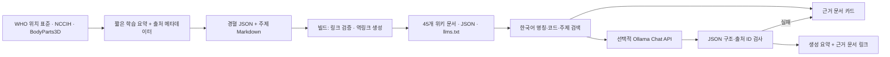

# LLM 위키의 구성

위키는 LLM이 작성한 출처 기반 초안을 문서로 보존하고, 명시적인 연결·역링크·근거·검수 상태를 붙인 지식 저장소입니다. 선택적으로 로컬 LLM에 검색 문서를 제공해 질문에 답하도록 합니다. 단순히 채팅 결과를 위키인 것처럼 보관하지 않습니다.

## 데이터 흐름



## 원본과 생성물

- `data/points.json`: 명칭, 한자, 병음, 경맥, 부위, 짧은 위치, 문헌 쪽수, 근사 앵커, 투영 방향, 관련 메쉬, 관련 경혈, 검수 상태.
- `data/anchors.json`: 실제 피부 메쉬에 대응한 좌우 표식과 표시 오프셋. 모델/위치 편집 후 빌드에서 재생성하며 미투영 표식은 오류 처리.
- `data/sources.json`: 원자료 ID, 저자/기관, 제목, URL, 자료 유형, 열람일, 접근 한계.
- `wiki/topics`: 사람이 수정할 수 있는 주제 문서. Front matter로 식별자와 근거 출처를 유지.
- `scripts/build-wiki.mjs`: 경혈 문서 작성, 내부 링크 무결성 검사, 역링크 생성, 웹/LLM용 파일 출력.
- `wiki/points`, `data/wiki.json`, `public/wiki`, `public/llms.txt`: 재현 가능한 생성 산출물.

## 검색과 생성

현재 45문서에 맞춘 로컬 키워드 검색입니다. 이름에 한국어 조사가 붙어도 명칭을 찾고, `LI 4`를 `LI4`로 정규화합니다. 명시된 경혈을 우선하고, 질문 주제에 맞는 방법론 문서를 추가합니다. 임베딩이나 외부 검색을 가장하지 않습니다. 검색은 미수록 경혈이나 임상 근거를 새로 조사하지 않습니다.

`POST /api/ask`는 1–1000자 질문을 받습니다. 로컬 LLM 미설정 시 `retrieval`, 근거 없으면 `no-evidence`, 시술 질문이면 `scope`를 반환합니다. Ollama 설정 시 상위 4문서를 질문과 함께 전송합니다. 공급자 URL은 서버 환경 변수만 사용하며 사용자가 요청에 넣은 URL은 받지 않습니다.

LLM 출력 형식:

```json
{
  "answer": [
    { "text": "문헌과 한계를 설명한 문단", "citations": ["points/ST36"] }
  ]
}
```

모든 문단에 검색된 문서 ID가 하나 이상 있어야 합니다. 잘못된 JSON, 검색 문서 밖의 출처, 비어 있는 인용은 거부하고 검색 결과로 전환합니다. 본문은 텍스트로 렌더링하므로 모델이 임의 HTML이나 외부 링크를 실행할 수 없습니다. 이 검사는 출처 ID의 존재 여부를 검사할 뿐, 인용 내용이 주장 전체를 뒷받침하는지 의미적으로 검증하지 못합니다. 생성 답변은 명시적으로 검증 필요 상태를 표시합니다.

## 실패와 개인정보

- 25초 공급자 제한, 응답 끊김에 대한 AbortSignal 처리
- 프로세스당 최대 2개 동시 질의, IP당 분당 30회 제한
- 8KB JSON 요청 상한, 질문 1000자 상한
- 프런트엔드 질문 실패 메시지 및 계속 이용할 수 있는 문서 탐색
- 앱은 질의/응답을 디스크에 저장하지 않음; 로컬 북마크만 브라우저 저장
- 공개 서비스에서는 다중 인스턴스용 공유 제한 저장소와 적절한 프록시 설정을 별도 적용해야 함

## 문서를 보강하는 순서

1. 원출처에서 근거를 확인하고 접근일·항목·쪽수를 기록합니다.
2. 긴 원문 복제 대신 독립적인 짧은 요약을 씁니다. 명칭/위치와 임상 효능 근거를 혼합하지 않습니다.
3. 정적 해부 관계와 모델 좌표를 따로 편집합니다. 원자료가 3D 좌표를 제공하지 않았으면 그렇게 표시합니다.
4. 경혈·주제 간 링크를 연결하고 `npm run wiki:build`를 실행합니다.
5. 의료 전문가가 문헌 위치, 모델 자세, 좌우, 해부 구조, 좌표를 검토합니다. 실제 검수자와 날짜 없이 검수 상태를 승인으로 변경하지 않습니다.
6. `npm test`, `npm run build`, 관련 브라우저 동작을 검증하고 변경 이력을 남깁니다.

현재 모든 의학적 서술 및 좌표는 AI 초안/전문가 미검수입니다. 실험적 LLM의 생성 결과로 영구 문서를 자동 덮어쓰지 않습니다.
